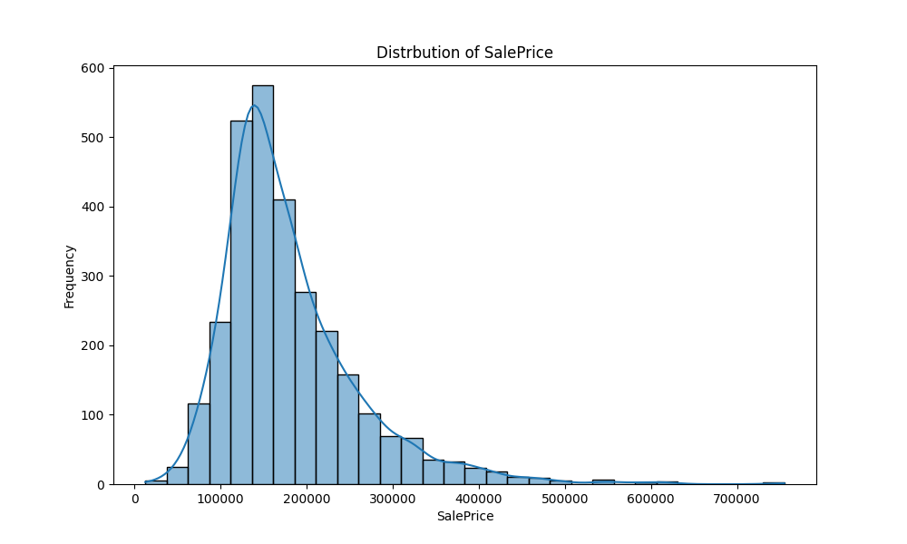
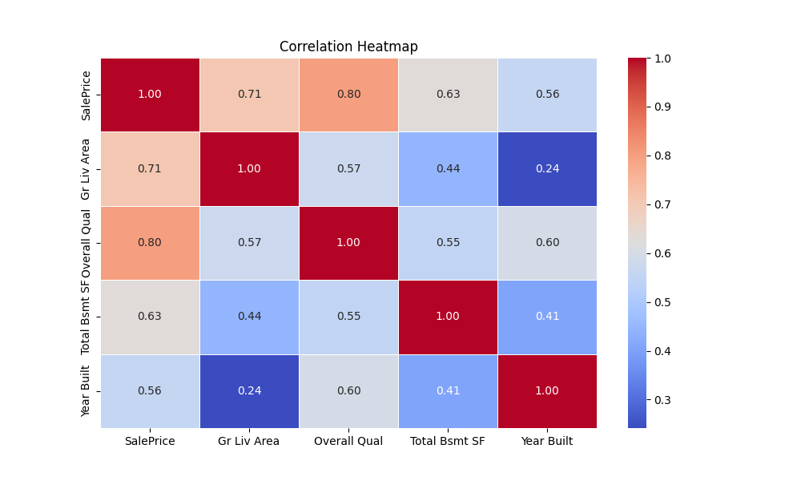

# EDA to MLOps with ZenML & MLflow 🚀

This project showcases an end-to-end machine learning pipeline built using **ZenML**, **MLflow**, and **pandas**. It starts from **exploratory data analysis (EDA)** and progresses to a **production-grade MLOps workflow**, demonstrating key components like data preprocessing, model training, evaluation, and experiment tracking.


## 🔧 Environment Setup

You can use either Python’s built-in `venv` or Anaconda’s `conda` to manage dependencies.


### ✅ Option 1: Using `venv`

#### 1. Create virtual environment
```bash
python -m venv mlOps
```
#### 2. Activate Environment
```bash
source mlOps/bin/activate
```
#### 3. Install Dependencies
```bash
pip install -r requirement.txt
```

### ✅ Option 2: Using `conda`

#### 1. Create virtual environment
```bash
conda create -n mlOps python=3.11
```
#### 2. Activate Environment
```bash
conda activate mlOps
```
#### 3. Install Dependencies
```bash
pip install -r requirement.txt
```

## 🧪 MLflow Integration with ZenML

To run deployment-related scripts (e.g., `run_deployment.py`), you must configure a ZenML stack that includes **MLflow** as both the **experiment tracker** and **model deployer**.

### 1. Install MLflow Integration

Install the MLflow integration for ZenML:

```bash
zenml integration install mlflow -y
```

### 2. Register an MLflow Experiment Tracker and Deployer
```bash
zenml experiment-tracker register mlflow_tracker --flavor=mlflow
zenml model-deployer register mlflow --flavor=mlflow
```

### 3. Register and Set the ZenML Stack
```bash
zenml stack register local-mlflow-stack -a default -o default -d mlflow -e mlflow_tracker --set
```

## 📊 Exploratory Data Analysis (EDA)

Once you set up the environment, you can explore your dataset interactively using the `run_data_analysis.py` script.


### Dataset Format

You can provide your dataset in one of the following formats:

- A **CSV** file (e.g., `data.csv`)
- A **ZIP** file containing a CSV (e.g., `data.zip` with `data.csv` inside)

### Running the Script

To start the EDA process, run:

```bash
python run_data_analysis.py
```

The script will prompt:

```bash
Enter path to dataset file (zip or csv)
```
Once the dataset is loaded, you'll be shown a list of available analysis options, such as:

```bash
Select Analysis

1. Data Inspection
2. Missing Values Analysis
3. Univariate Analysis
4. Bivariate Analysis
5. Multivariate Analysis
6. Exit
```
Enter the number corresponding to the analysis you'd like to perform. You can run multiple analyses in a single session.

### 🔍 Example Exploratory Data Analysis Visualizations

Here are some example visualizations you might see when using the EDA script:

---
>   
> *Histogram showing feature value distribution.*

>   
> *Correlation matrix of numerical features.*

---

